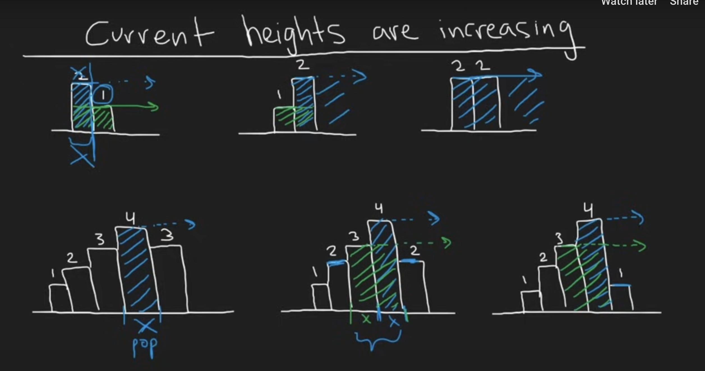

https://leetcode.com/problems/largest-rectangle-in-histogram/description/

# Though process



- monotonic stack
- use m_stack to keep track of next smaller value (WHY???)
  When loop through each block - add to a stack for later discovery. Then if we face the block that has smaller height than top of m_stack, which means we can extend further to the right -> pop then calculate the total current max area
- when finishing discovering all the histogram, but m_stack is not empty, which means we finish the discovery -> try calculate the max area of the width is the length of histogram for each value inside the stack (all value inside stacks guarantee that has the height)

```python
class Solution:
    def largestRectangleArea(self, heights: List[int]) -> int:
        stack = []
        res = 0
        N = len(heights)

        for i,h in enumerate(heights):
            start = i
            while stack and stack[-1][1] > h:
                idx, height = stack.pop()
                res = max(res, height * (i-idx))
                start = idx
            stack.append((start, h))

        for i,h in stack:
            res = max(res, h * (N - i))
        return res
```
