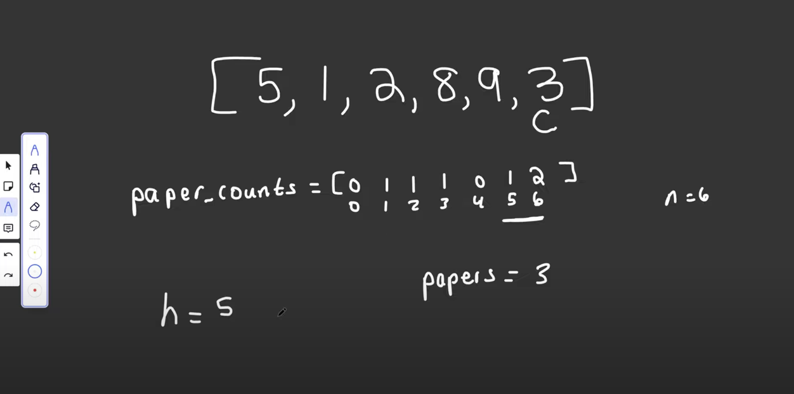

### URL: https://leetcode.com/problems/h-index/submissions/1502609616/?envType=study-plan-v2&envId=top-interview-150


### Thinking-process
#### Brute force
- loop h from 0 ->
  - nested loop each value inside the citations[], increase the count -> if count == h return
  - make sure to find the max h
- TC: O(N^2)


#### Optimize
- Using counting sort
- Create an array with length + 1
  

- For each citation inside the array citations. If found any citation larger than the length -> increase the value of the countingSort[len]++
- Otherwise, set the coutingSort[citation]++
- What does it mean?
  - Each element inside the countingSort array mean: there is at least `num` has `index` citation
  - eg: at least 1 paper has at least one citation, at least 2 papers that have at least 5 citations (8,9)

- Then loop from the back of countingSort array:
  - add the value to the variable count
  - if (count >= i) -> return the i

```java
class Solution {
    public int hIndex(int[] citations) {
        int len = citations.length;
        int count = 0;
        int[] countingSort = new int[len + 1];
        for(int citation : citations) {
            if(citation >= len) {
                countingSort[len]++;
            } else {
                countingSort[citation]++;
            }
        }
        for(int i = len; i >= 0; i--) {
            count += countingSort[i];
            if(count >= i) {
                return i;
            }
        }
        return 0;


        
    }
}
```