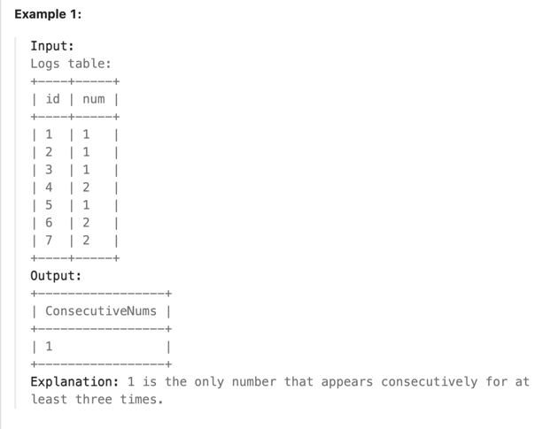

- query num that appear three times with different id

### URL: https://leetcode.com/problems/consecutive-numbers/description/

### Thinking process
- There are two ways
  - use in
  - select from table Logs three times


```sql
select distinct num as ConsecutiveNums from Logs
WHERE (Id + 1, num) in (select * from Logs) and (Id + 2, num) in (select * from Logs)
```


```sql
select distinct (t1.num) as ConsecutiveNums From Logs t1, Logs t2, Logs t3 WHERE t1.num = t2.num AND t2.num = t3.num AND t1.id + 1 = t2.id AND t2.id + 1 = t3.id 
```